# Project #1 - Library Project using Dart - Lama Aldhafeeri

I enjoyed developing library project in dart. that manage a library book inventory and user interactions.

The main functions in this project are:
1. **Let user Add New Book**
2. **Let user delete Book**
3. **Let user edit Book information**
4. **Let user query Books**
5. **The user can purchase a book and then the invoice details will be shown to him/her**
Secondary objective:
1. **Let user view all Book Categories and then choes one of them to view books related to chosen categorie**

2. **the user can view number of purchases**

## Project outputs:
First, if the user choose "1" then all Categories displayed.

Then the user can write one of categories to get all related books.

Number "2" for Query Books by writing title or author or category of the book exist it will display.

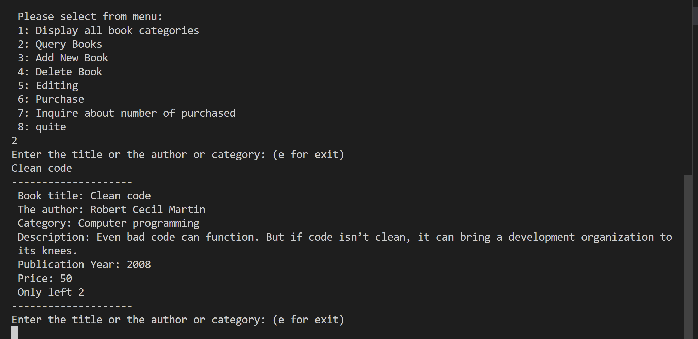

If the book not exist message below appear.

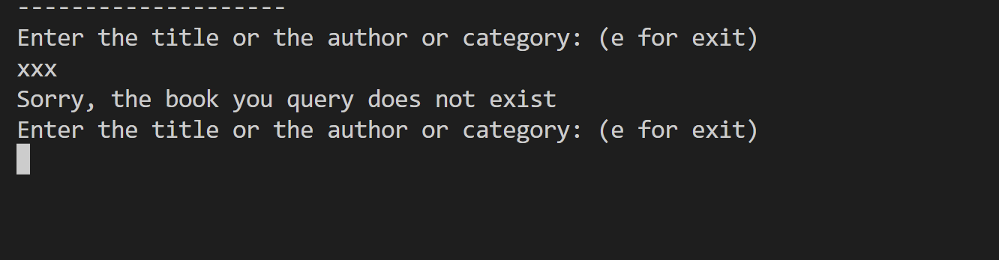

Number "3" for adding new book:
If the user entered new book that is not exist in the data then then the system will ask him/her to fill all required data

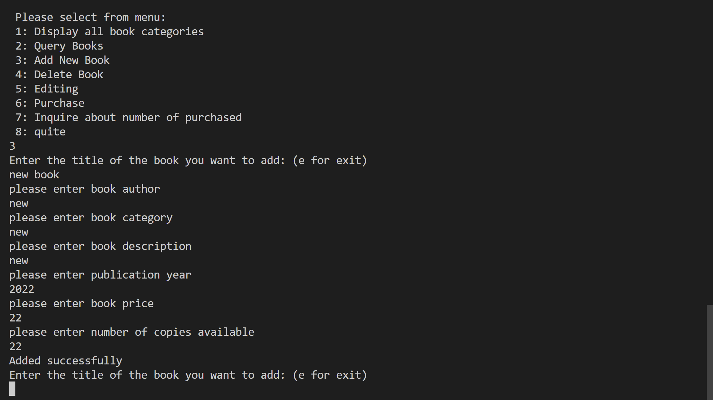

check if the book is added:

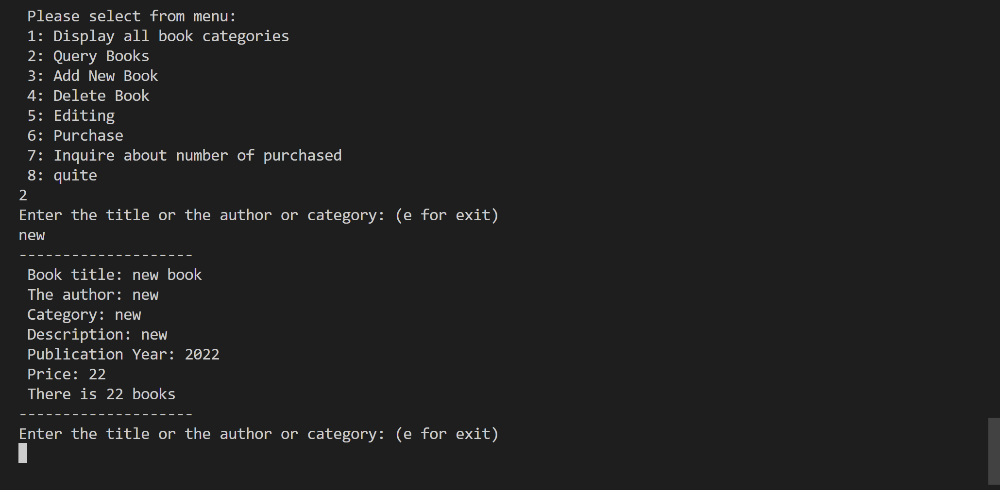

Then if the book already exist then the message below appear that gives the user choose to only increase number of copics 

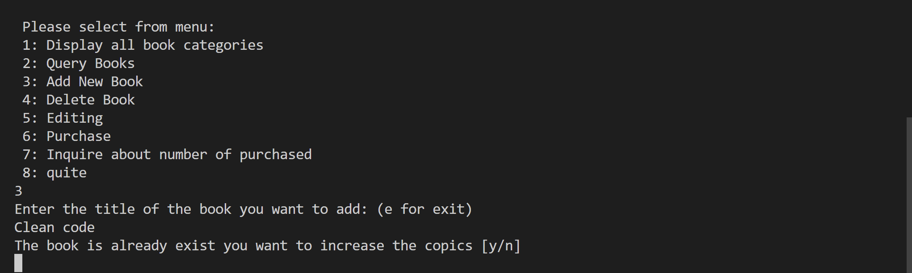

once the user enter "y" then the system will update the available copies depend on number of copies entered by user

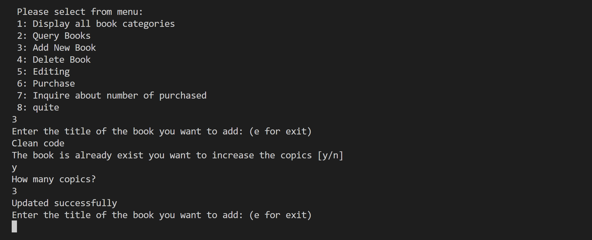 

before: 

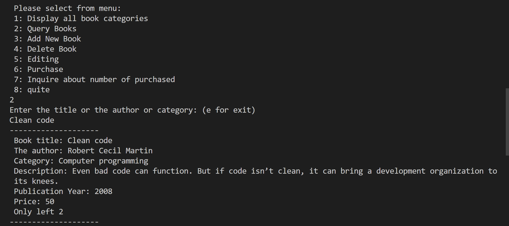

after:

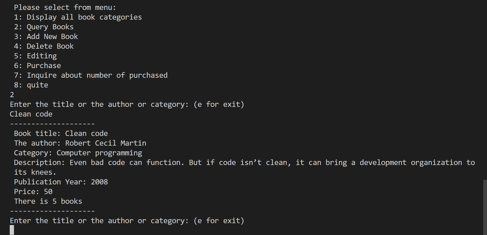

Number "4" for deleting:

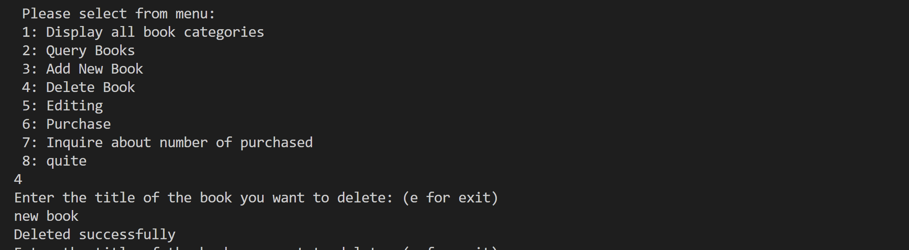

check if the book is deleted:

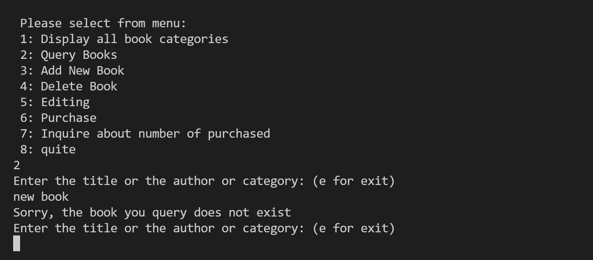

Number "5" for editing:

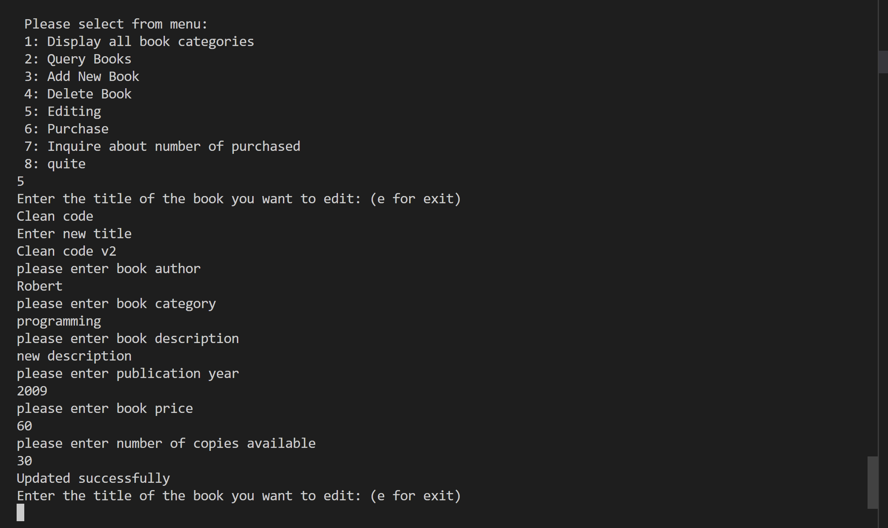

check:

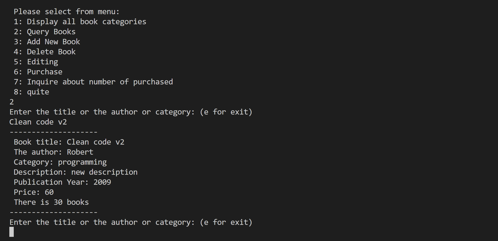

if the user entered invalid data or empty data or entered name of book that does not exist those messages below appear:

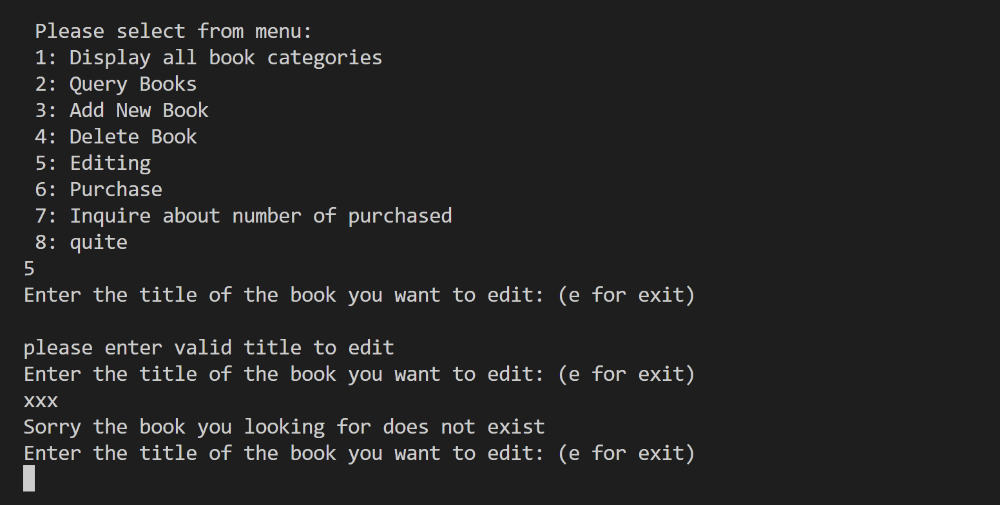

Number "6" for Purchase:
if the user try to buy more than the copies existing the system will alert him/her of number of available copies:

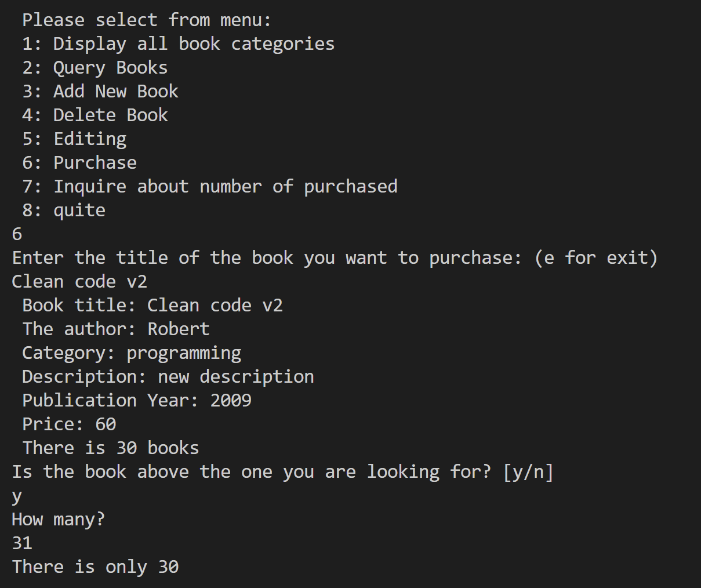

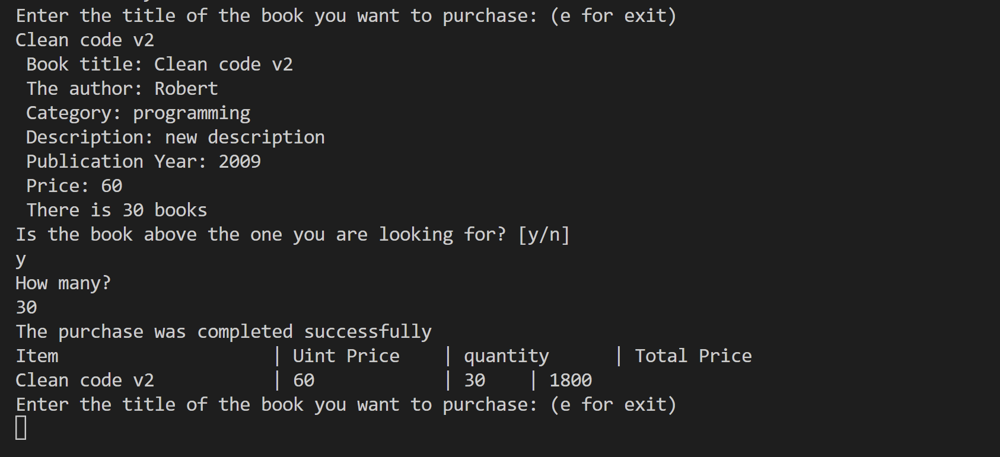

After buying all available copies the number of copies will decrease so the user won't be able to buy it

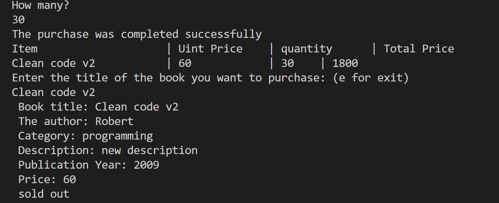

last thing the user can inquire about number of purchased by chose number "7"
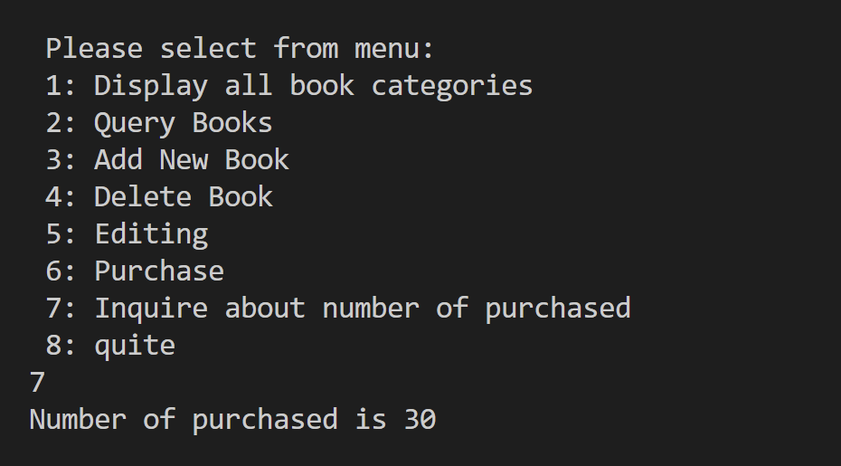

Number "8" for exit.

