# Project #1 - Library Project using Dart

Congratulations on reaching the project phase! This project will assess your ability to develop a "Library Project using Dart" with a Command Line Interface (CLI) to manage a library's book inventory and user interactions. Below are the key requirements and evaluation criteria:

## Project Description:
- when running the project, it will show a greeting (read text from file), then display the services menu:
  
  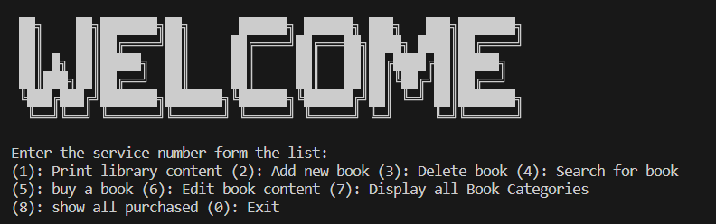

  it has 9 choices:
(1): Print library content (2): Add new book (3): Delete book (4): Search for book
(5): buy a book (6): Edit book content (7): Display all Book Categories (8):show all purchased (0): Exit

## (1) : Print library content
  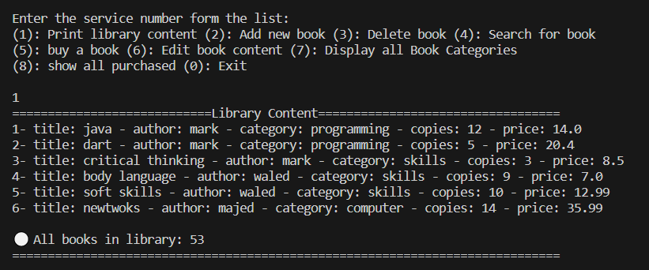
  
  it displaysy all detaile of books in the library, and print total number of books         

  

## (2): Add new book
  it has 2 choices:         
  1- add new book       
  2- inrement number of copies
  
  #### 1- as shown, we add new book to library ,now we want to print all library content to check is new book added or not
  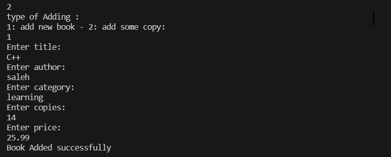
  
  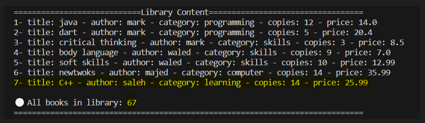

  new book is added

  ---------------------------------------------------------

  #### 2- add some copy to any book , user add 8 copeis to the first book 
  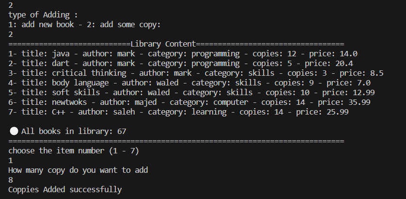
  
  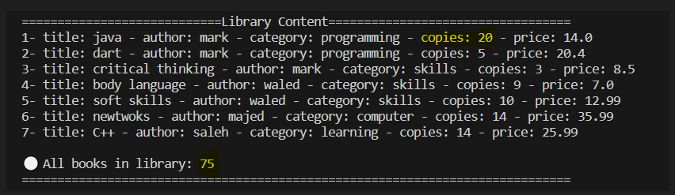       

   
  
  ## (3): Delete book
  it has 2 choices:         
  1- Delete all copeis       
  2- Delete some copeis 
  
  ### 1- Delete book (3) form library
  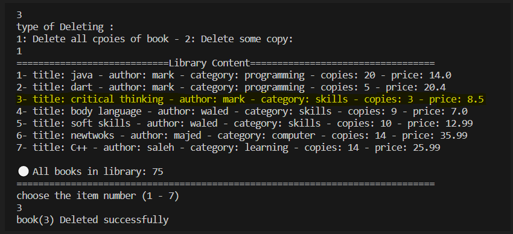    
  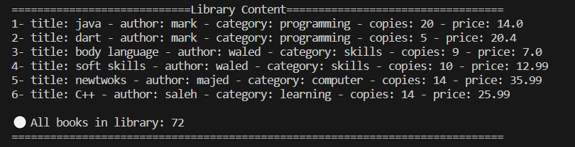    

  ### 2- Delete 4 copies from book (5) form library
  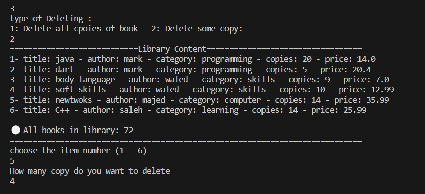    
    
   
  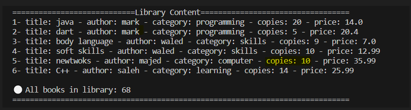   

  ### - case : if user all copies for a book , then remove it form library
  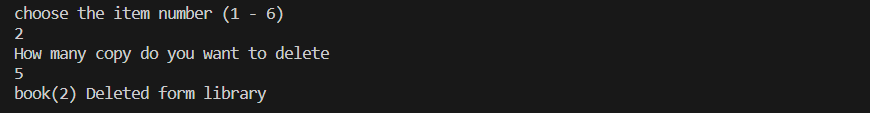   
  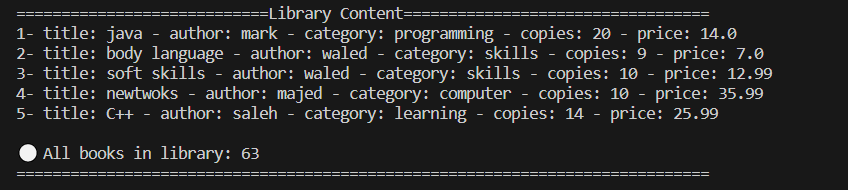   

   
  
  ## (4): Search for book
  it has 3 choices:         
  1- by title
  2- by author
  3- by categoryy

  ### 1- search by title , then print all copies 
  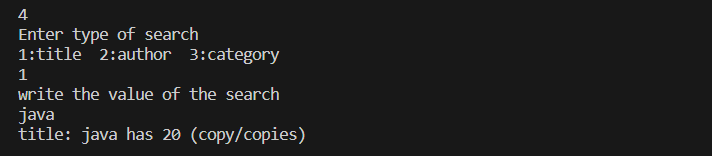
  
  ### 2- search by author , then print all copies 
  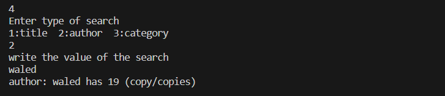   
  ### 3- search by categoryy , then print all copies 
  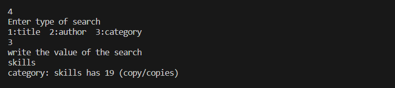  

  ## (5): buy a book then shows a detaile and total price
  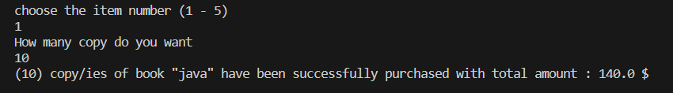  
  
  ### case : if user buy all copies , then the book will remove form library , then print Sold out
  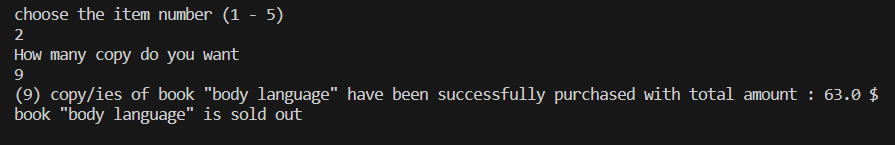  

  
  ## (6): Edit book content
  
  change "java" To "Newjava"
  
  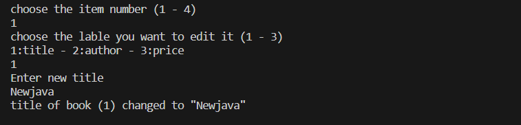  
  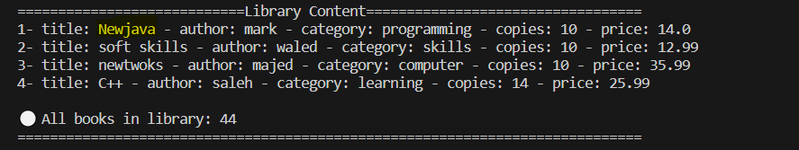  

  
  ## (7): Display all Book Categories
  
  it has 2 choices:         
  1- all category
  2- specific

  ### 1- all category
  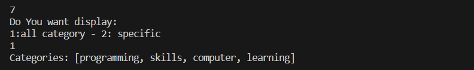
  

  ## (8):show all purchased
  After choose a book to buy it 
  ### case : when we buy same book with same information more than 1 time , in purchase list , just increment the copies user buy 3 the 5 copies so , total is 8 
  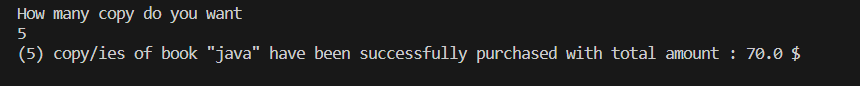
  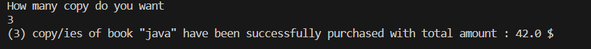
  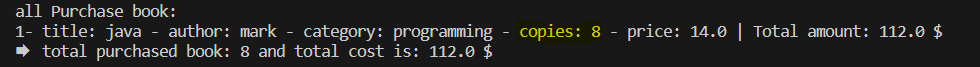

  ### But when user edit title or any think , it will considered it as another book 
  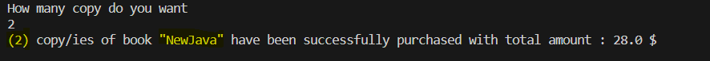
  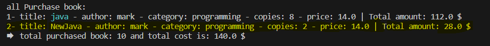

  
  ## (0):Eixt 
  close the projramm , the print thanks message 
  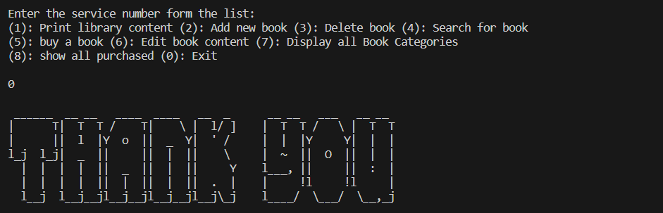
  

  
