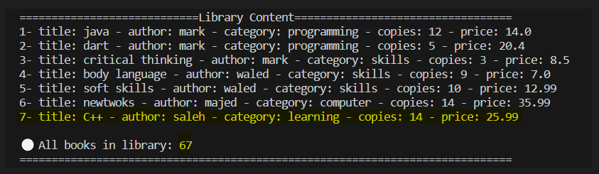

# Project #1 - Library Project using Dart

Congratulations on reaching the project phase! This project will assess your ability to develop a "Library Project using Dart" with a Command Line Interface (CLI) to manage a library's book inventory and user interactions. Below are the key requirements and evaluation criteria:

## Project Description:
- when running the project, it will show a greeting (read text from file), then display the services menu:
  
  

  it has 9 choices:
(1): Print library content (2): Add new book (3): Delete book (4): Search for book
(5): buy a book (6): Edit book content (7): Display all Book Categories(8): show all purchased (0): Exit

## (1) : Print library content
  
  
  it displaysy all detaile of books in the library, and print total number of books

## (2): Add new book
  

  it has 2 choices:         
  1- add new book       
  2- inrement number of copies

  #### as shown, we add new book to library ,now we want to print all library content to check is new book added or not
  

  new book is added

